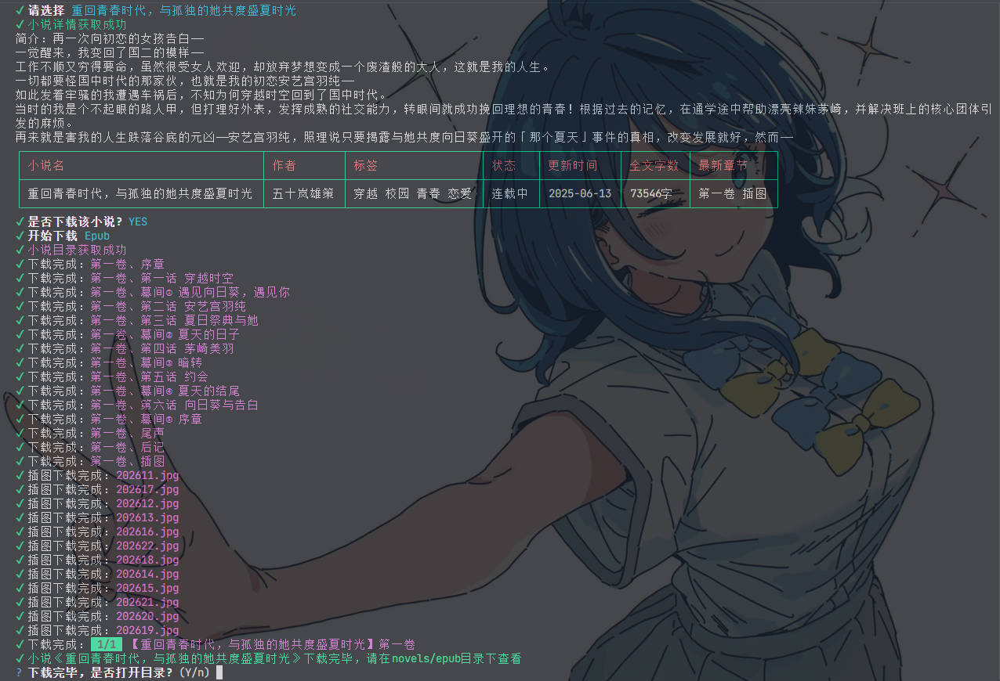
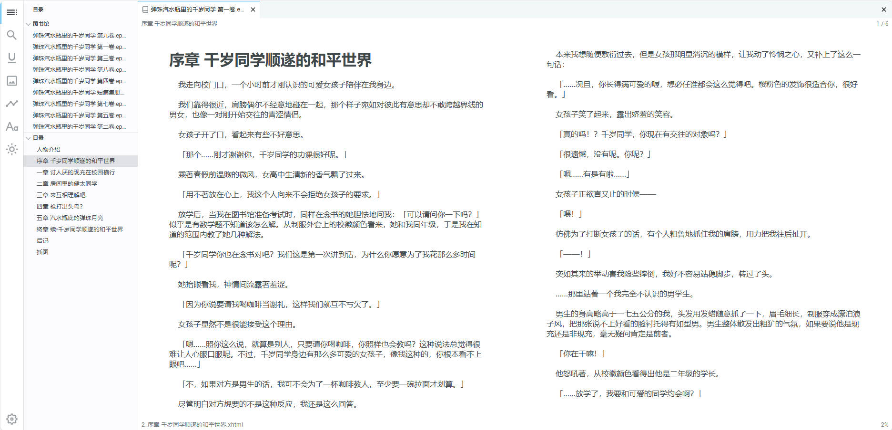


<div align="center">
<h1 align="center" style="margin-top: 0">wenku8轻小说下载器</h1>
<p align="center">
<strong>本工具基于Nodejs实现，可用来下载轻小说文库的小说内容</strong>
</p>

[](https://github.com/fateking27/wenku8-downloader)


[](https://github.com/fateking27/wenku8-downloader/releases/latest)

</div>



## 介绍

本工具可用来下载 [轻小说文库](https://www.wenku8.net/index.php) 的小说，支持以下功能

- ✅ 生成*epub*格式的电子书
- ✅ 生成*txt*格式的电子书
- ✅ 根据小说名、作者名进行搜索
- ✅ 支持仅下载插图
- ✅ 支持下载*wenku8*站点已下架的小说

## 使用

### 方式一

[下载](https://github.com/fateking27/wenku8-downloader/releases/download/wenku8-downloader/wenku8-downloader.zip) 解压后直接双击打开 `wenku8-downloader.exe` 即可使用

### 方式二

本工具基于NodeJS实现，请确保已安装了 [Node环境](https://nodejs.org/en/)

``` shell
git clone https://github.com/fateking27/wenku8-downloader.git
cd wenku8-downloader
npm install -g yarn
```

执行完以上命令后直接双击`start.bat`文件即可运行，也可以在命令行中运行`yarn && yarn start`


### 其他

⚠请注意：由于wenku8站点开启cloudflare防火墙以及图片站点网络不稳定的缘故，在获取插画和小说内容时可能会出现失败和较长等待时间的情况




