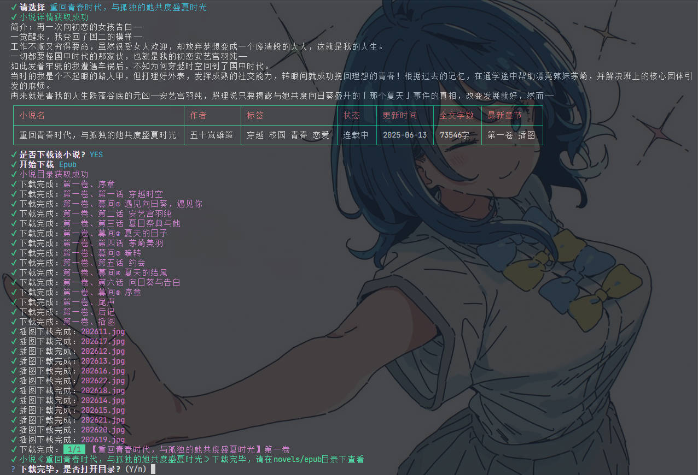
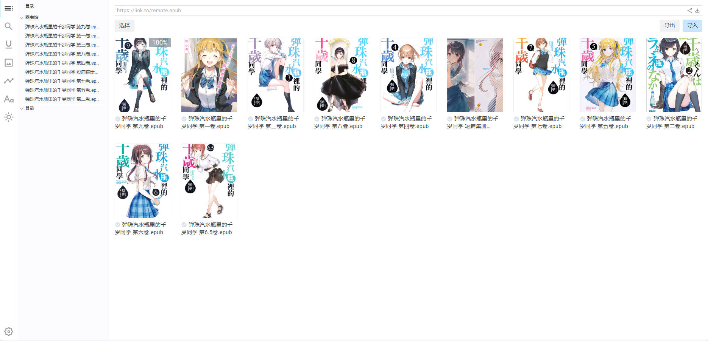
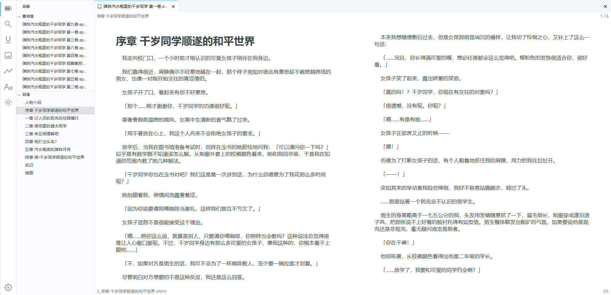


<div align="center">
<h1 align="center" style="margin-top: 0">wenku8轻小说下载器</h1>
<p align="center">
<strong>基于 Bun.js 轻小说下载工具</strong>
</p>

[](https://github.com/fateking27/wenku8-downloader)


[](https://github.com/fateking27/wenku8-downloader/releases/latest)

</div>



## ✨ 功能特性

本工具用于下载 [轻小说文库](https://www.wenku8.net/index.php) 的小说内容，支持以下功能：

### 📚 下载格式
- ✅ 生成 **EPUB** 格式电子书（支持自定义封面）
- ✅ 生成 **TXT** 格式电子书
- ✅ 仅下载小说插图

### 🔍 查询功能
- ✅ 根据 **小说ID** 精确查询
- ✅ 根据 **小说名称** 模糊搜索
- ✅ 根据 **作者名称** 查询作品
- ✅ 查看 **今日热榜**
- ✅ 查看 **新书风云榜**
- ✅ 查看 **最近更新** 小说列表

### 🎯 特色功能
- ✅ 支持下载 **已下架小说**
- ✅ 支持 **全卷下载** 或 **自定义分卷下载**
- ✅ 支持 **代理池** 可添加多个代理

## 🚀 快速开始

### 方式一：直接使用（推荐）
[下载](https://github.com/fateking27/wenku8-downloader/releases/download/v0.2.1/v0.2.1.zip) 最新版本，解压后双击运行 `wenku8-downloader.exe` 即可使用。

### 方式二：源码运行
需要先安装 [Bun](https://bun.sh/) 运行环境。

```bash
# 克隆项目
git clone https://github.com/fateking27/wenku8-downloader.git
cd wenku8-downloader

# 安装依赖
bun install

# 运行程序
bun start
```

## 📖 使用指南

### 主菜单选项
运行程序后，您可以选择以下操作：

| 选项 | 功能说明 |
|------|----------|
| 查询小说 | 通过ID、小说名或作者名搜索小说 |
| 今日热榜 | 查看当日热门小说排行 |
| 新书风云榜 | 查看最新上架的小说 |
| 查看最近更新轻小说 | 查看近期有更新的小说列表 |

### 下载选项
选择小说后，支持以下下载格式：

| 格式 | 说明 |
|------|------|
| Epub | 生成带封面、插图和目录的电子书 |
| TXT | 生成纯文本格式电子书 |
| 插图 | 仅下载小说中的所有插图 |

### 代理配置
如果网络访问不稳定，可在 `proxy.config.json` 中配置代理：
'proxy'为是否开启代理，默认false。'proxyList'为代理列表（仅支持HTTP代理），每个代理为一个字符串，格式为'IP:端口'。

```json
{
  "proxy": true,
  "proxyList": [
    "127.0.0.1:7890"
  ]
}
```

## ⚠️ 注意事项

1. **网络问题**：由于 wenku8 站点启用了 Cloudflare 防火墙，图片站点网络可能不稳定，在获取插图和内容时可能会出现延迟或失败，请耐心等待。

2. **已下架小说**：对于已下架的小说，程序会自动切换到wenku8站点的接口进行下载，但此模式下仅支持 TXT 格式。

3. **代理使用**：如遇访问困难，建议配置代理以提高下载成功率。

## 📸 效果预览





## 📄 开源协议

本项目基于 [MIT](LICENSE) 协议开源。

## 🙏 数据来源

- 数据来源：[轻小说文库](https://www.wenku8.net/)

